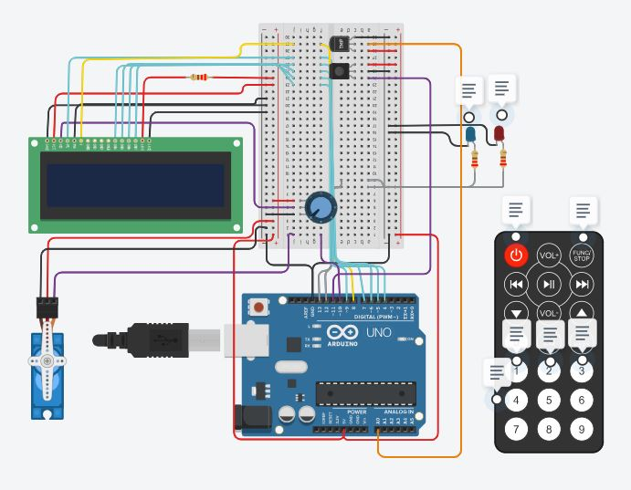

# Parcial_SPD_Ferrari_Franco

## Creador
  -Franco Ferrari

## Proyecto: Elevador Hospital Posadas.

## Descripción
El programa muestra el movimiento del elevador del hospital Posadas recorriendo sus siete pisos.

Los dispositivos utilizados fueron: 1 led verde (muestra cuando el elevador esta en movimiento), 1 led rojo (muestra cuando el elevador se encuentra detenido), 1 led de siete segmentos (muestra el piso en el que se encuentra), 3 botones pull-down (uno sube el elevador, otro lo baja y el otro lo detiene).

Al comienzo del programa se definen constantes para referir los leds y los botones a los pines en los que se encuentran conectados, luego se declaran una serie de variables las cuales son un contador el cual asigna los pisos y varios booleans que van comprobando el movimiento del elevador.

Luego hay varias funciones que se ejecutan dentro del loop y que tienen como parametro el contador y van siendo validadas con los booleans, generalmente cuando se presiona un botón. 

La funcion incrementarContador() lo que hace es que comienza llamando a la funcion millis() para contar el tiempo en la ejecucion de la funcion y cada 3000 ms aumenta el contador.
La funcion decrementarContador() lo que hace es que comienza llamando a la funcion millis() para contar el tiempo en la ejecucion de la funcion y cada 3000 ms reduce el contador.
La funcion botonPresionado() evalua si el boton fue presionado y devuelve true si es que asi fue.
la función encender() recibe como parametro un led y lo prende.
la función apagar() recibe como parametro un led y lo apaga.
La función numerarSieteSegmentos() toma como parametro un contador y lo pone en un switch en el cual en cada case (hasta el 7) muestra el numero en el siete segmentos.

## Función principal
La siguiente funcion se encarga de mostrar por el siete segmentos el valor que va teniendo el contador.
~~~ C++ (lenguaje en el que esta escrito)
void mostrarContador(int contador, int tiempo) {
  static unsigned long tiempoAnterior = 0;

  if (millis() - tiempoAnterior >= tiempo) {
    switch (contador) {
      case 0:
        numerarSieteSegmentos(1, 1, 1, 1, 1, 1, 0);
        Serial.println("El montacarga se encuentra en planta baja");
        break;
      case 1:
        numerarSieteSegmentos(0, 1, 0, 0, 1, 0, 0);
        Serial.println("El montacarga se encuentra en piso 1");
        break;
      case 2:
        numerarSieteSegmentos(1, 1, 1, 1, 0, 0, 1);
        Serial.println("El montacarga se encuentra en piso 2");
        break;
      case 3:
        numerarSieteSegmentos(1, 1, 0, 1, 1, 0, 1);
        Serial.println("El montacarga se encuentra en piso 3");
        break;
      case 4:
        numerarSieteSegmentos(0, 1, 0, 0, 1, 1, 1);
        Serial.println("El montacarga se encuentra en piso 4");
        break;
      case 5:
        numerarSieteSegmentos(1, 0, 0, 1, 1, 1, 1);
        Serial.println("El montacarga se encuentra en piso 5");
        break;
      case 6:
        numerarSieteSegmentos(1, 0, 1, 1, 1, 1, 1);
        Serial.println("El montacarga se encuentra en piso 6");
        break;
      case 7:
        numerarSieteSegmentos(1, 1, 0, 0, 1, 0, 0);
        Serial.println("El montacarga se encuentra en piso 7");
        break;
    }

    tiempoAnterior = millis();
  }
}
~~~

## :robot: Link al proyecto
- [proyecto](https://www.tinkercad.com/things/9xRN0OA5sDF-franco-ferrari-pp-spd/editel?sharecode=da4tHVUiULhT1VRnoPa1pwEiQDMaEhGdfFqHiDSKUdw)
---
### Fuentes

- [Youtube]https://www.youtube.com/@cefuve
- [ChatGPT]https://chat.openai.com/
- [Arduino]https://www.arduino.cc/en/Guide
---
